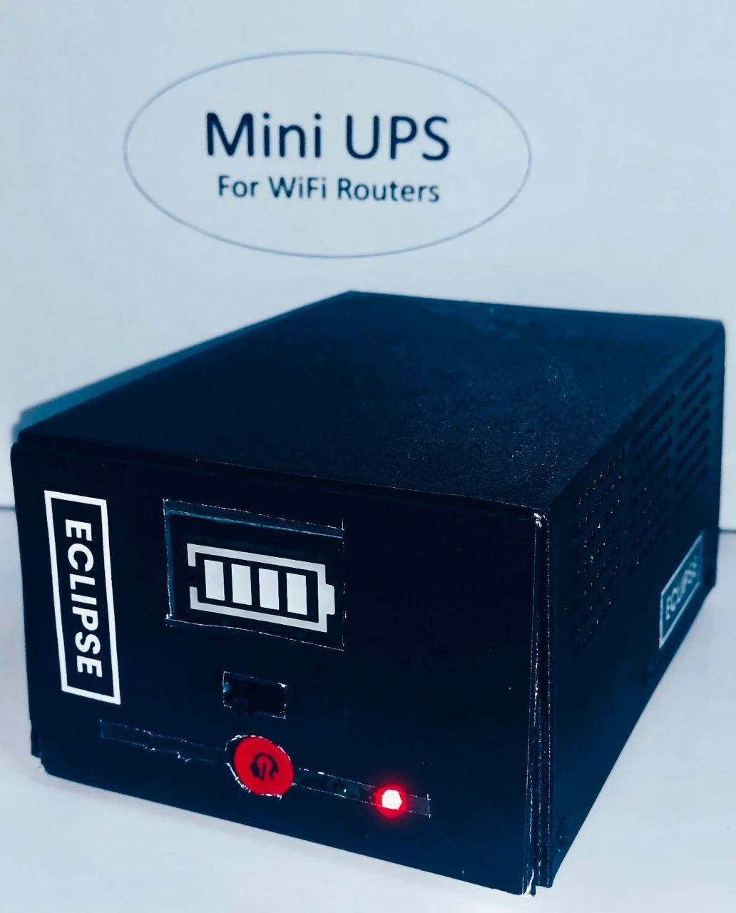

# Portable-Mini-UPS 

## Overview

This is a compact, portable uninterruptible power supply (UPS) designed to keep Wi-Fi routers powered during blackouts. It supports both 9V and 12V outputs with automatic switching between main power and battery backup to ensure continuous operation.

Developed as part of the 2nd semester project module.

---

## Key Features

- Stable 9V and 12V output to support a wide range of routers  
- Automatic power source switching to maintain uninterrupted service  
- Portable and compact design for easy placement near routers  

---

## Folder Structure

- **`pcb/`** — Main PCB design source file (`.PcbDoc`) for editing in Altium Designer  
- **`pcb/project_outputs/`** — Manufacturing output files (Gerbers, drill files, mechanical layers) for PCB fabrication  
- **`images/`** — Product photos  
- **`report/`** — Project report PDF and documentation files  

---

## Components Used

| Component          | Specifications       | 
|--------------------|----------------------|
| Buck Converter     | XL4015               | 
| Boost Converter    | LM2596, LM2577       |
| BMS Module         | 2S, 5A               | 
| Batteries          | 3.7V, 3200mAh (×4)   | 
| Other Components   | Diodes, MOSFETs, Resistors, LEDs | 

---

## Images

  
*Portable Mini UPS fully assembled and ready to use.*

---

## How to Use This Repo

- Open the PCB source file in `pcb/` with Altium Designer to view or modify the design.  
- Use the files in `pcb/project_outputs/` to manufacture the PCB.  
- Refer to images in `images/` for visual references.  
- Check the `report/` folder for the full project documentation.

---

Feel free to reach out if you have any questions!
